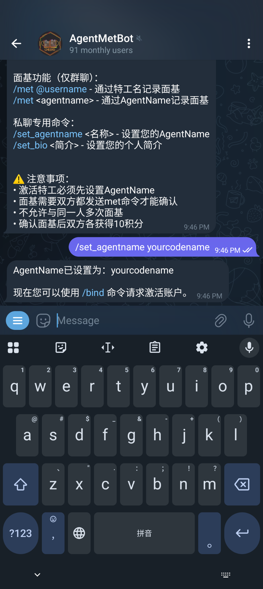
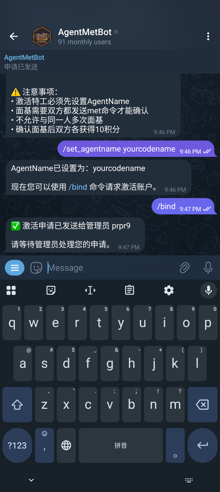

# Met Bot クイックスタート！

## ステップ1：ボットを見つけて起動する

Telegramの検索バーで[AgentMetBot](https://t.me/AgentMetBot)を検索し、最初のオプションをクリックします。


ボットを起動したら、`/help`をクリックしてヘルプを確認します。

> 💡 たくさんのコマンドがありますが、まずはゲームIDを紐付けましょう！

---

## ステップ2：Telegram Usernameを設定する（推奨）

まず、**Telegram Username**を設定しているか確認してください。  
これは他の人があなたと`met`リクエストを送信するのにとても便利です！

> 📌 注意：設定しなくても会うことはできますが、相手があなたの完全なゲームIDを手動で入力する必要があり、少し面倒です。

---

## ステップ3：ゲームID（AgentName）を紐付ける

ボットのヘルプメッセージにある`/set_agentname`コマンドを長押しすると、入力ボックスに自動的にコピーされます。

```
/set_agentname
```

次に、入力ボックスにゲームID（AgentName）を直接入力します。例：

```
/set_agentname YourAgentName
```

送信して紐付けを完了します。




---

## ステップ4：認証を申請する（/bind）

コマンドを入力：

```
/bind
```

ボットは現在利用可能な**Met Bot管理者**をリストアップし、認証のために知り合いの管理者を選択できます。

> ✅ 管理者があなたを知っていることを確認してください！

### 地域別管理者（参考）：

- **東北地区**：FushimiHikoniwa  
- **北京**：xana233  
- **大湾区**：Davida / YogaLee17  
- **湖北/湖南**：eastx / LY128  
- **上海**：ODBLK / CA49LACHS  
- **西南**：NotRealNicad / TaoChingChung / icecrEEEEam  
- **中部/西北**：prpr9
- **福建**：W7lww




対応する管理者をクリックした後、**直接会うか他のグループで認証を承認するよう催促してください**。  
ボットは認証メッセージをプッシュしますが、管理者がすぐに確認するとは限りません。

---

## ステップ5：Metを開始する！

`met`を開始するには2つの方法があります：

1. **相手のTelegram Usernameを使用**（推奨）  
   グループで入力：
   ```
   /met @TheirUsername
   ```
   > 同じグループにいる場合、オートコンプリートができてとても便利です！

2. **相手のゲームAgent Nameを使用**  
   相手の完全なゲームIDを入力する必要があります：
   ```
   /met TheirGameID
   ```

> ⚠️ `Met`アクションは**グループ内で行う必要があります**が、グループをまたいだ`met`もサポートされています。


---

## ステップ6：他の人のMetリクエストに応答する

誰かがあなたに`met`を送ると、ボットは次のような通知を送信します：


**手順**：

1. **通知メッセージ内の`/met xxxxx`テキストをクリック**（手動で選択してコピーしないでください！）  
   → コマンドが自動的にクリップボードにコピーされます。
2. **ボットがいるグループ**に移動し、コマンドを貼り付けて送信します。

✅ おめでとうございます！ミートアップが成功しました！+10ポイント！

---

## ヒント

- 他の人とのミートアップの瞬間を記録しましょう！楽しい食事を～  
- **バーチャルミートアップをしないでください**（実際に会わずにmetを送信すること）！

---
