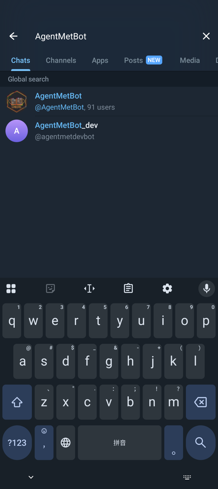
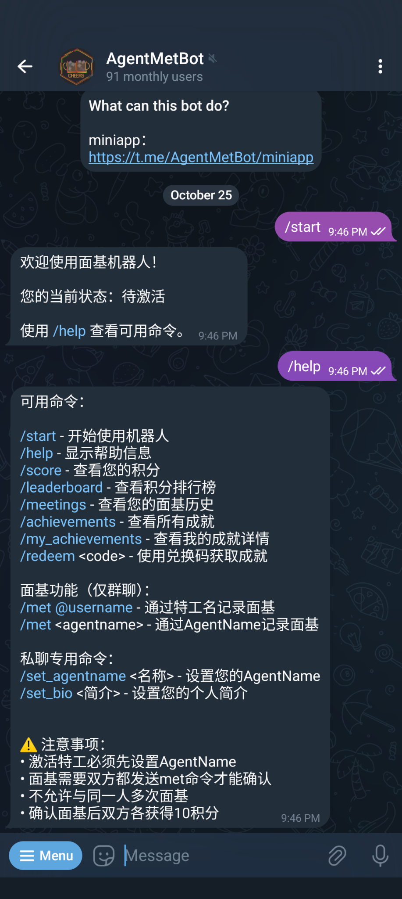
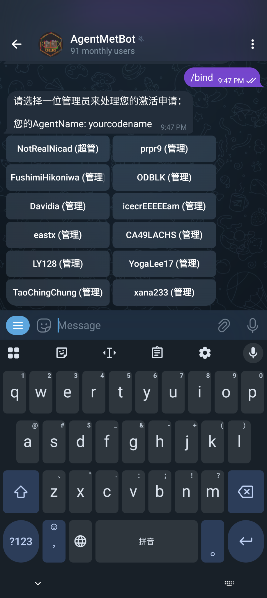
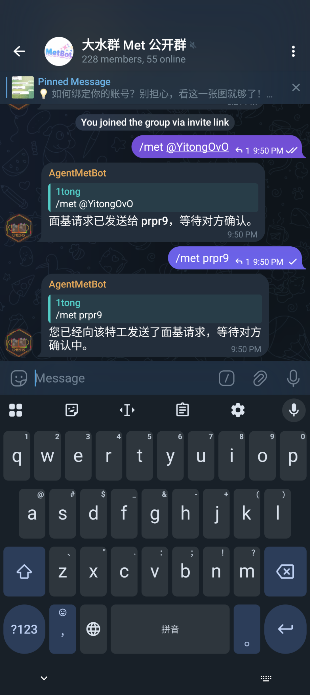
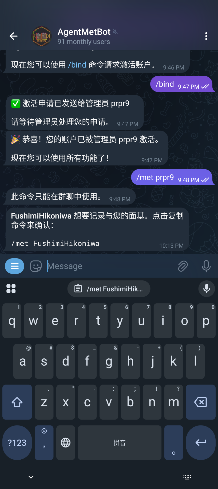
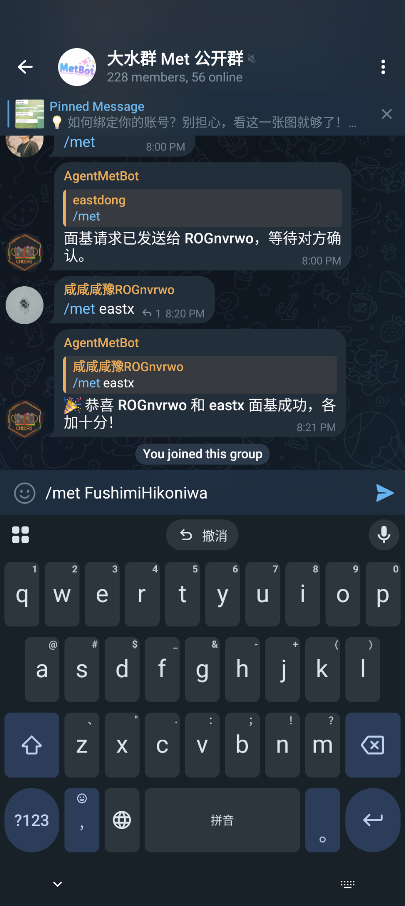

# Met Bot 快速入门！

## 第一步：找到并启动机器人

在 Telegram 的搜索栏中搜索 [AgentMetBot](https://t.me/AgentMetBot)，并点击第一个选项。



启动机器人后，系统会自动为你注册账号（状态为 `pending` 待激活）。

> 💡 你可以点击 `/help` 查看帮助信息。

---

## 第二步：设置 Telegram Username（推荐）

请先确认自己是否设置了 **Telegram Username**。
这对其他人发起 `met` 非常有帮助！

> 📌 注意：不设置也能面基，但需要别人手动输入你的完整游戏 ID，比较麻烦。

---

## 第三步：设置 AgentName（私聊）

私聊机器人，使用 `/set_agentname` 命令设置你的游戏 ID。

```
/set_agentname YourAgentName
```

**AgentName 格式要求：**
- 3-15 个字符
- 仅限半角英文字母和数字
- 不能包含特殊符号或空格

> ⚠️ 注意：此命令只能在私聊中使用，且激活后无法修改。



---

## 第四步：选择社区并申请激活（私聊）

设置好 AgentName 后，使用 `/bind` 命令申请激活账号。

```
/bind
```

**流程说明：**

1. **选择社区**
   Bot 会先列出所有可用的**社区**，请选择你所在地区的社区。

2. **选择管理员**
   选择社区后，会显示该社区的所有管理员列表，请选择你认识的**管理员**为你激活。

> ✅ 请确保选择的管理员认识你，否则申请可能会被拒绝！

### 管理员按地区划分（参考）：

- **东北地区**：FushimiHikoniwa（摸妹）
- **北京**：xana233（插哪）
- **大湾区**：Davida（散打） / YogaLee17（油咖喱）
- **湖北/湖南**：eastx（东东） / LY128（老姨）
- **上海**：ODBLK（老黑） / CA49LACHS（小卡尔）
- **西南**：NotRealNicad（迷你卡） / TaoChingChung（大套） / icecrEEEEam（五套）
- **中部/西北**：prpr9（一桶）
- **福建**：W7lww



点击对应的管理员后，请在**线下或其他群组中催促他们通过审核**。
虽然 Bot 会推送审核消息，但管理员不一定及时查看。

---

## 第五步：等待管理员激活

管理员收到你的申请后，会核实你的身份。管理员会看到：
- 你的 AgentName
- 你的 Telegram Username
- 你的注册时间
- 你的 Ingress Intel 链接

如果确认你是真实的特工，管理员会点击「同意激活」按钮。

激活成功后，你会收到通知，现在你已经可以使用所有功能了！

---

## 第六步：发起 Met！

激活成功后，你就可以在**有机器人的群组**中发起面基了。

### 发起方式：

1. **使用对方的 Telegram Username**（推荐）
   ```
   /met @对方的Username
   ```
   > 如果你们在同一个群，可以自动补全，非常方便！

2. **使用对方的 AgentName**
   ```
   /met 对方的AgentName
   ```

3. **回复消息发起**（最方便）
   直接回复对方的消息，输入：
   ```
   /met
   ```

> ⚠️ `Met` 命令**必须在群组中使用**，但支持跨群组面基。



---

## 第七步：确认面基请求

当别人向你发起 `met` 请求时，Bot 会给你发送一条私聊通知。



**操作步骤**：

1. **点击通知消息中的 `/met xxxxx` 文本部分**（不要手动选中复制！）
   → 这会自动将命令复制到剪贴板。
2. 前往一个**有 Bot 的群组**，粘贴并发送该命令。

✅ 恭喜！你已完成一次面基！双方各获得 10 积分！



> ⏰ **注意**：面基请求有 24 小时有效期，超时后需要重新发起。

---

## 其他常用命令

### 查看个人信息
- `/whoami` - 查看你的个人信息、积分和成就
- `/score` - 查看当前积分
- `/my_achievements` - 查看你的成就列表

### 查询他人信息
- `/whois @username` - 查询他人的特工信息

### 面基记录
- `/meetings` - 查看你的面基历史记录
- `/leaderboard` - 查看积分排行榜

### 成就系统
- `/achievements` - 查看所有可获得的成就
- `/redeem <兑换码>` - 使用兑换码获取特殊成就

### 个人设置
- `/set_bio <简介>` - 设置个人简介（最多200字符）
- `/set_language` - 更改机器人语言（支持中文/English/日本語）

---

## 群组管理员命令

如果你是 Telegram 群组的管理员，可以使用以下命令管理群组：

### 面基功能管理
- `/enable_met` - 在本群启用面基功能
- `/disable_met` - 在本群禁用面基功能
- `/group_status` - 查看群组设置状态

### 成员管理
- `/invite @username` 或 `/invite <agentname>` - 邀请用户加入群组（有效期 8 小时）
- `/set_group_language` - 设置群组语言

### 入群欢迎
- `/set_group_greeting` - 开启/关闭新成员入群提醒

---

## 常见问题

### Q: 为什么不能在私聊中使用 /met 命令？
A: 面基功能设计为群组活动，必须在有机器人的群组中使用。不过，面基请求会通过私聊通知对方。

### Q: 面基请求过期了怎么办？
A: 如果你在收到面基请求后 24 小时内没有回复，请求会过期。你可以：
- 等待对方重新发起
- 自己主动向对方发起面基请求

### Q: 可以和同一个人多次面基吗？
A: 不可以。每两个人只能面基一次，这是为了鼓励大家认识更多新朋友！

### Q: 积分有什么用？
A: 积分是你在面基社区活跃度的体现，可以在排行榜上看到自己的排名。积分也会随着成就解锁而增加。

### Q: 如何获取成就？
A: 成就可以通过以下方式获取：
- 参与线下面基活动
- 使用兑换码（管理员发布）
- 参加社区活动

### Q: AgentName 可以修改吗？
A: 不可以。一旦激活账号，AgentName 就无法修改，请谨慎设置。

### Q: 选择社区后一定要选该社区的管理员吗？
A: 是的，你需要选择所选社区内的管理员为你激活。请选择你认识且认识你的管理员。

---

## 温馨提示

- 记录下你和他人的面基瞬间吧！约饭愉快～
- **不要隔空面基**（即未实际见面就提交 met）！
- 遇到问题可以私聊机器人使用 `/help` 查看完整命令列表

---
